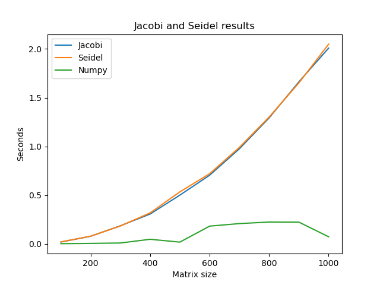

# HOMEWORK 2: iterative method of solving Linear System of Equations

Foobar is a Python library for dealing with word pluralization.

## Description

task2.1.py - Jacoby linear equation solution 

task2.2.py - Zeidel linear equation solution

task2.0.py - Both methods equation solution

## Usage

Use this commands to solve equations

```bash
python3 task2.1.py
python3 task2.2.py
```
## Results

