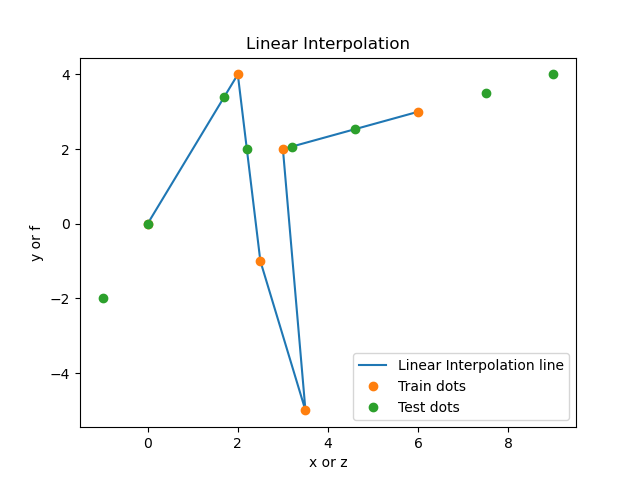

# HOMEWORK 3: Linear interpolations

## Description

task3.1.py - This program performs linear interpolation on an uneven grid

test.ans - output data on the Y axis (formed by the linear interpolation formula)

test.dat - output data on the X axis (a new linear interpolation is formed from this data)

train.ans - input data on the Y axis (we build linear interpolation from them)

train.dat - input data on the X axis (we build linear interpolation from them)

## Usage

Open folder with interpolation that's you need and use this commands to solve equations

```bash
python3 task3.1.py
```
## Results

