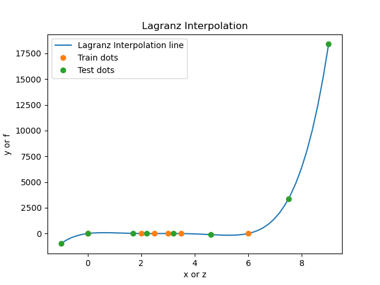

# HOMEWORK 3: Lagrange interpolations

## Description

task3.2.py - This program performs Lagrange interpolation on an uneven grid


test.ans - output data on the Y axis (formed by the Lagrange interpolation formula)

test.dat - output data on the X axis (a new interpolation is formed from this data)

train.ans - input data along the Y axis (we build interpolation from them)

train.dat - input data on the X axis (we build interpolation from them)

## Usage

Use this command to execute program

```bash
python3 task3.2.py
```
## Results

