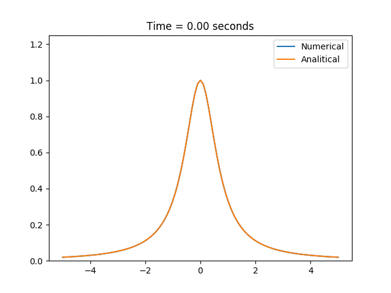

# HOMEWORK 4: Convection diffusion and Heat equation

This program solves the problem of the Convection diffusion equation.

## Description

task4.1.py - This program solves the problem of the convection diffusion equation.

## Usage

PLEASE, BE PATIENT! PROGRAM NEED ONE MINUTE TO CREATE A GIF!

Use this commands to solve equation

```bash
python3 task4.1.py
```
## Results

